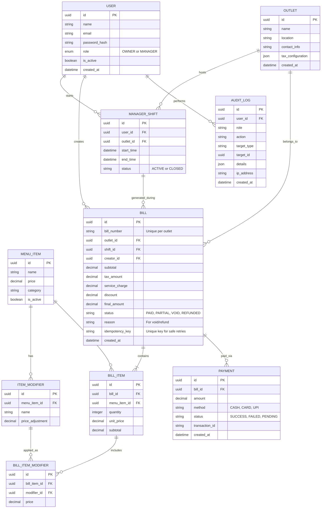

# RRB Fast Food and Chinese - Entity Relationship Diagram

```mermaid
erDiagram
    USER {
        uuid id PK
        string name
        string email
        string password_hash
        enum role "OWNER or MANAGER"
        boolean is_active
        datetime created_at
    }

    OUTLET {
        uuid id PK
        string name
        string location
        string contact_info
        json tax_configuration
        datetime created_at
    }

    MANAGER_SHIFT {
        uuid id PK
        uuid user_id FK
        uuid outlet_id FK
        datetime start_time
        datetime end_time
        string status "ACTIVE or CLOSED"
    }

    MENU_ITEM {
        uuid id PK
        string name
        decimal price
        string category
        boolean is_active
    }

    ITEM_MODIFIER {
        uuid id PK
        uuid menu_item_id FK
        string name
        decimal price_adjustment
    }

    BILL {
        uuid id PK
        string bill_number "Unique per outlet"
        uuid outlet_id FK
        uuid shift_id FK
        uuid creator_id FK
        decimal subtotal
        decimal tax_amount
        decimal service_charge
        decimal discount
        decimal final_amount
        string status "PAID, PARTIAL, VOID, REFUNDED"
        string reason "For void/refund"
        string idempotency_key "Unique key for safe retries"
        datetime created_at
    }

    BILL_ITEM {
        uuid id PK
        uuid bill_id FK
        uuid menu_item_id FK
        integer quantity
        decimal unit_price
        decimal subtotal
    }

    BILL_ITEM_MODIFIER {
        uuid id PK
        uuid bill_item_id FK
        uuid modifier_id FK
        decimal price
    }

    PAYMENT {
        uuid id PK
        uuid bill_id FK
        decimal amount
        string method "CASH, CARD, UPI"
        string status "SUCCESS, FAILED, PENDING"
        string transaction_id
        datetime created_at
    }

    AUDIT_LOG {
        uuid id PK
        uuid user_id FK
        string role
        string action
        string target_type
        uuid target_id
        json details
        string ip_address
        datetime created_at
    }

    USER ||--o{ MANAGER_SHIFT : starts
    OUTLET ||--o{ MANAGER_SHIFT : hosts
    USER ||--o{ BILL : creates
    OUTLET ||--o{ BILL : belongs_to
    MANAGER_SHIFT ||--o{ BILL : generated_during
    MENU_ITEM ||--o{ ITEM_MODIFIER : has
    BILL ||--|{ BILL_ITEM : contains
    MENU_ITEM ||--o{ BILL_ITEM : is
    BILL_ITEM ||--o{ BILL_ITEM_MODIFIER : includes
    ITEM_MODIFIER ||--o{ BILL_ITEM_MODIFIER : applied_as
    BILL ||--o{ PAYMENT : paid_via
    USER ||--o{ AUDIT_LOG : performs
```
